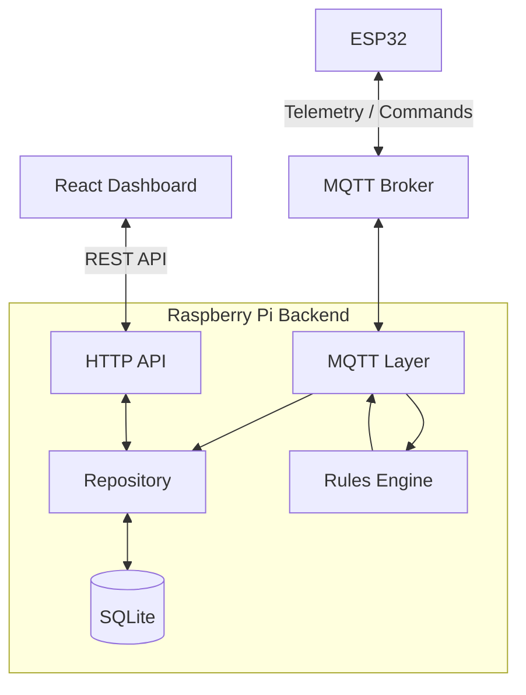

# Higiene_Sueño
Este repositorio tiene toda la información referente a la implementación de un sistema que ayuda a mejorar la higiene del sueño.

## Descripción
El proyecto se trata de una plataforma distribuida de IoT para el monitoreo de la higiene del sueño, recolectando datos ambientales desde sensores instalados en la habitacion, evalua reglas de automatizacion configurables y expone una interfaz web para el monitoreo de las mediciones, las configuraciones y de las acciones realizadas.

## Arquitectura

